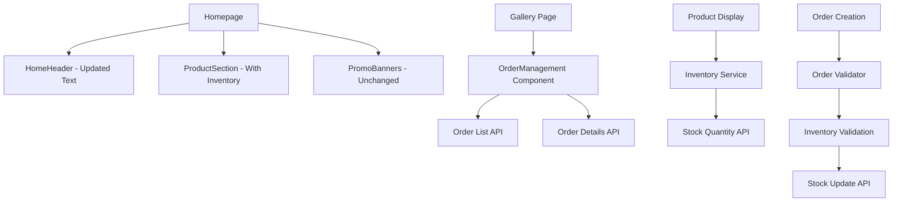

# Design Document: APPEJV-Web Improvements

## Overview

This design implements five key improvements to the APPEJV-Web application: homepage content optimization, revenue text correction, gallery page replacement with order management, enhanced product inventory display, and robust order validation. The solution maintains the existing Next.js/React architecture while enhancing user experience and business functionality.

The design focuses on minimal disruption to existing components while adding new capabilities for inventory visibility and order management. All changes leverage the existing TypeScript, React, and Tailwind CSS technology stack.

## Architecture

### Component Architecture

The improvements follow the existing component-based architecture:

```
src/
├── components/
│   ├── dashboard/
│   │   ├── HomeHeader.tsx (modified)
│   │   ├── ProductSection.tsx (modified)
│   │   └── OrderManagement.tsx (new)
│   └── ui/
│       └── InventoryDisplay.tsx (new)
├── app/
│   ├── gallery/
│   │   └── page.tsx (replaced)
│   └── orders/
│       └── create/
│           └── page.tsx (enhanced)
└── services/
    ├── api.ts (enhanced)
    └── inventory.ts (new)
```

### Data Flow Architecture



## Components and Interfaces

### Modified Components

#### HomeHeader Component
**Location:** `src/components/dashboard/HomeHeader.tsx`
**Changes:** Update revenue text from "Thu nhập dự kiến" to "Doanh thu dự kiến"

```typescript
interface HomeHeaderProps {
  currentMonth: number;
  revenueData?: RevenueData;
}

// Text change implementation
const revenueText = `Doanh thu dự kiến T${currentMonth}`;
```

#### ProductSection Component
**Location:** `src/components/dashboard/ProductSection.tsx`
**Changes:** Add inventory display to each product card

```typescript
interface ProductWithInventory extends Product {
  stock_quantity: number;
  min_stock_level: number;
  max_stock_level: number;
}

interface ProductSectionProps {
  products: ProductWithInventory[];
  showInventory: boolean;
}
```

#### Homepage Layout
**Location:** `src/app/page.tsx`
**Changes:** Remove ContentGallery component from homepage

```typescript
// Remove ContentGallery import and component usage
export default function HomePage() {
  return (
    <div className="min-h-screen bg-gray-50">
      <HomeHeader />
      <PromoBanners />
      <ProductSection showInventory={true} />
      {/* ContentGallery removed */}
    </div>
  );
}
```

### New Components

#### OrderManagement Component
**Location:** `src/components/dashboard/OrderManagement.tsx`
**Purpose:** Replace gallery content with order management interface

```typescript
interface Order {
  id: string;
  customer_name: string;
  customer_phone: string;
  status: 'pending' | 'confirmed' | 'delivered' | 'cancelled';
  total_amount: number;
  created_at: string;
  items: OrderItem[];
}

interface OrderManagementProps {
  orders: Order[];
  onOrderSelect: (orderId: string) => void;
  loading: boolean;
}
```

#### InventoryDisplay Component
**Location:** `src/components/ui/InventoryDisplay.tsx`
**Purpose:** Reusable component for showing inventory status

```typescript
interface InventoryDisplayProps {
  stockQuantity: number;
  minStockLevel: number;
  showWarning?: boolean;
  size?: 'sm' | 'md' | 'lg';
}

type InventoryStatus = 'in_stock' | 'low_stock' | 'out_of_stock' | 'updating';
```

### Enhanced Services

#### Inventory Service
**Location:** `src/services/inventory.ts`
**Purpose:** Centralized inventory management and validation

```typescript
interface InventoryService {
  getProductInventory(productId: string): Promise<InventoryData>;
  validateOrderQuantities(orderItems: OrderItem[]): Promise<ValidationResult>;
  updateInventoryAfterOrder(orderItems: OrderItem[]): Promise<void>;
  checkConcurrentAccess(productId: string, quantity: number): Promise<boolean>;
}

interface ValidationResult {
  isValid: boolean;
  errors: InventoryError[];
  availableQuantities: Record<string, number>;
}

interface InventoryError {
  productId: string;
  productName: string;
  requestedQuantity: number;
  availableQuantity: number;
  message: string;
}
```

#### Enhanced API Service
**Location:** `src/services/api.ts`
**Purpose:** Add inventory and order management endpoints

```typescript
// New API methods
async function getOrdersList(): Promise<Order[]>;
async function getOrderDetails(orderId: string): Promise<OrderDetails>;
async function validateInventoryForOrder(items: OrderItem[]): Promise<ValidationResult>;
async function updateProductInventory(productId: string, quantity: number): Promise<void>;
```

## Data Models

### Enhanced Product Model
```typescript
interface Product {
  id: string;
  name: string;
  description: string;
  price: number;
  category: string;
  image_url?: string;
  // Enhanced inventory fields
  stock_quantity: number;
  min_stock_level: number;
  max_stock_level: number;
  last_updated: string;
}
```

### Order Management Models
```typescript
interface Order {
  id: string;
  customer_name: string;
  customer_phone: string;
  customer_address?: string;
  status: OrderStatus;
  total_amount: number;
  created_at: string;
  updated_at: string;
  items: OrderItem[];
  notes?: string;
}

interface OrderItem {
  id: string;
  product_id: string;
  product_name: string;
  quantity: number;
  unit_price: number;
  total_price: number;
}

type OrderStatus = 'pending' | 'confirmed' | 'processing' | 'delivered' | 'cancelled';
```

### Inventory Validation Models
```typescript
interface InventoryValidationRequest {
  items: {
    product_id: string;
    quantity: number;
  }[];
  order_id?: string; // For updates
}

interface InventoryValidationResponse {
  valid: boolean;
  errors: {
    product_id: string;
    product_name: string;
    requested: number;
    available: number;
    message: string;
  }[];
  warnings: {
    product_id: string;
    message: string;
  }[];
}
```

## Correctness Properties

*A property is a characteristic or behavior that should hold true across all valid executions of a system-essentially, a formal statement about what the system should do. Properties serve as the bridge between human-readable specifications and machine-verifiable correctness guarantees.*

Based on the prework analysis, I've identified several properties that can be consolidated to eliminate redundancy:

**Property Reflection:**
- Properties 4.1 and 4.4 (inventory display and formatting) can be combined into one comprehensive property about inventory display consistency
- Properties 5.1, 5.2, 5.4 (order validation) can be combined into one comprehensive validation property
- Properties 6.1 and 6.3, 6.4 (data consistency and error handling) can be combined into one property about consistent data handling

### Property 1: Order Information Display Completeness
*For any* order displayed in the order management interface, the rendered output should include order ID, customer information, status, and total amount
**Validates: Requirements 3.3**

### Property 2: Product Inventory Display Consistency
*For any* product with inventory data, the display should show stock quantity formatted as "Tồn kho: {quantity}" and include appropriate status indicators based on stock levels
**Validates: Requirements 4.1, 4.4**

### Property 3: Low Stock Warning Display
*For any* product where stock_quantity is below min_stock_level, the display should show a low stock warning indicator
**Validates: Requirements 4.3**

### Property 4: Order Validation Completeness
*For any* order creation attempt, the validator should check all item quantities against available stock and either allow the order (if all items have sufficient stock) or prevent it with specific error messages (if any items have insufficient stock)
**Validates: Requirements 5.1, 5.2, 5.4**

### Property 5: Inventory Validation Error Messages
*For any* order validation failure, the error message should specify which products have insufficient stock and show both requested and available quantities
**Validates: Requirements 5.3**

### Property 6: Stock Update After Order
*For any* successfully validated order, the stock_quantity for each ordered product should be reduced by the ordered quantity
**Validates: Requirements 5.5**

### Property 7: Consistent Inventory Data Source
*For any* page displaying inventory information, the stock data should come from the same API endpoint and service layer
**Validates: Requirements 6.1**

### Property 8: Graceful Error Handling for Inventory
*For any* inventory data loading failure, the application should display appropriate fallback content and loading states without crashing
**Validates: Requirements 6.3, 6.4**

## Error Handling

### Component-Level Error Handling

**HomeHeader Component:**
- Handle missing revenue data gracefully
- Display fallback text if month data is unavailable
- Maintain component stability during data loading

**ProductSection with Inventory:**
- Handle missing inventory data with "Đang cập nhật" status
- Gracefully degrade when API calls fail
- Show loading states during inventory fetching

**OrderManagement Component:**
- Handle empty order lists with appropriate messaging
- Display error states when order loading fails
- Provide retry mechanisms for failed API calls

### Service-Level Error Handling

**Inventory Service:**
- Implement retry logic for inventory API calls
- Handle concurrent access conflicts gracefully
- Provide detailed error messages for validation failures
- Log inventory-related errors for debugging

**Order Validation:**
- Return structured error responses with specific product information
- Handle edge cases like deleted products or price changes
- Implement timeout handling for validation requests

### API Error Handling

**Network Failures:**
- Implement exponential backoff for API retries
- Cache inventory data when possible to reduce API dependency
- Provide offline-capable fallbacks for critical functionality

**Data Consistency:**
- Handle stale data scenarios with refresh mechanisms
- Implement optimistic updates with rollback capabilities
- Validate data integrity before displaying to users

## Testing Strategy

### Dual Testing Approach

This feature requires both unit testing and property-based testing to ensure comprehensive coverage:

**Unit Tests** focus on:
- Specific component rendering scenarios (homepage layout, text changes)
- Edge cases (empty order lists, zero inventory, API failures)
- User interaction flows (navigation, form submission)
- Integration points between components and services

**Property Tests** focus on:
- Universal properties that hold across all data inputs
- Inventory validation logic across various order scenarios
- Data consistency across different components and pages
- Error handling behavior across different failure modes

### Property-Based Testing Configuration

**Testing Library:** Use `@fast-check/jest` for TypeScript/React property-based testing
**Test Configuration:** Minimum 100 iterations per property test
**Tagging Format:** Each property test must include a comment referencing the design document property

Example property test structure:
```typescript
// Feature: appejv-web-improvements, Property 2: Product Inventory Display Consistency
test('inventory display formatting', () => {
  fc.assert(fc.property(
    fc.record({
      stock_quantity: fc.integer({ min: 0, max: 1000 }),
      min_stock_level: fc.integer({ min: 1, max: 100 })
    }),
    (product) => {
      const display = renderInventoryDisplay(product);
      expect(display).toContain(`Tồn kho: ${product.stock_quantity}`);
      if (product.stock_quantity < product.min_stock_level) {
        expect(display).toContain('low stock warning');
      }
    }
  ));
});
```

### Unit Testing Strategy

**Component Testing:**
- Test HomeHeader text changes with various month values
- Test ProductSection inventory display with different stock levels
- Test OrderManagement component with various order states
- Test InventoryDisplay component with edge cases

**Service Testing:**
- Test inventory validation with valid and invalid orders
- Test API error handling and retry logic
- Test concurrent access scenarios where possible
- Test data transformation and formatting functions

**Integration Testing:**
- Test complete order creation flow with inventory validation
- Test homepage rendering without ContentGallery
- Test gallery page replacement with order management
- Test inventory updates after successful orders

### Test Data Management

**Mock Data Strategy:**
- Create realistic product data with various inventory levels
- Generate order scenarios covering all validation cases
- Include edge cases like zero stock, negative quantities, missing data
- Use Vietnamese text in test data to validate localization

**API Mocking:**
- Mock inventory API responses for consistent testing
- Simulate API failures and network issues
- Test loading states and error conditions
- Validate API call patterns and parameters